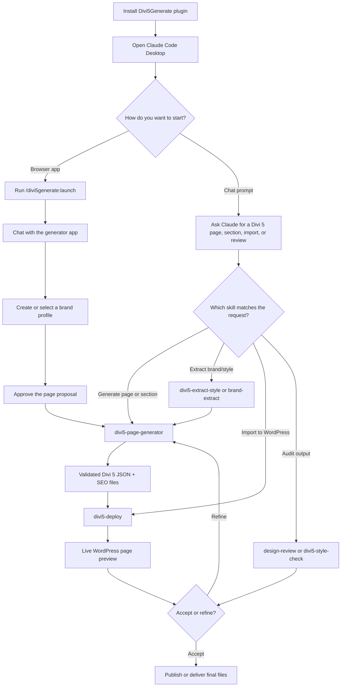

# Divi5Generate Plugin

Standalone Claude Code plugin. This repo IS the plugin — root = plugin root.

## Structure

```
Divi5Generate/
├── .claude-plugin/
│   ├── plugin.json          # plugin name, version, description
│   └── marketplace.json     # advertises this repo as a single-plugin marketplace
├── skills/
│   └── <skill-name>/
│       └── SKILL.md         # frontmatter + instructions
├── commands/
├── docs/
├── app/                     # Node builder library (page generator)
└── plugin/                  # WordPress site connector plugin (PHP)
```

## Install on a new machine

```bash
claude plugin marketplace add Kieransaunders/Divi5Generate
claude plugin install divi5generate@divi5generate
```

Then open Claude Code Desktop — it picks up the install automatically from `~/.claude`.

## User workflow diagram



Typical prompts:

- "Launch the Divi 5 generator."
- "Create a Divi 5 landing page for a roofing company in Exeter."
- "Extract the brand style from this Divi export, then generate a services page."
- "Import the latest generated page into my WordPress site."
- "Create a nav menu from my generated pages and put it in the primary location."
- "Review this Divi export against the original brief."

## Plugin registration (settings.json)

```json
"extraKnownMarketplaces": {
  "divi5generate": { "source": { "source": "git", "url": "https://github.com/Kieransaunders/Divi5Generate.git" } }
},
"enabledPlugins": {
  "divi5generate@divi5generate": true
}
```

## Output location (generated artefacts)

Generated pages, sections, previews, tokens, SEO meta and `generate-*.js` scripts **must never be written into this repo**. The canonical output folder is:

- `process.env.DIVI5_OUT` if set, otherwise `~/Desktop/Divi5 Pages`.

The app (`app/server.js`) enforces this: it resolves the output dir (defaulting to `~/Desktop/Divi5 Pages/<brand>-<timestamp>`, expanding `~`) and passes it to the generator as both `cwd` and the `DIVI5_OUT` env var. The file-writing skills (`divi5-page-generator`, `divi5-deploy`, `divi5-extract-style`) read this convention and write only to that folder. When running a generator manually, resolve `OUT` the same way and `cd` into it before running the validator / preview / on-disk gate.

`.gitignore` keeps only a safety-net for stray root artefacts — the real fix is that nothing should be written here in the first place.

## Skills

All skills live in `skills/`. Each `SKILL.md` requires:

```yaml
---
name: skill-name
description: "What it does and when to use it. Triggers: keyword1, keyword2."
---
```

`description` is **mandatory** — Claude uses it to decide when to invoke the skill.

After editing a skill: `git push` → restart Desktop or run `/reload-plugins`.

## Testing locally (no push needed)

```bash
claude --plugin-dir /Volumes/External/Divi5Generate
```

Run `/reload-plugins` inside the session to pick up edits without restarting.

## Desktop vs CLI

- **Desktop** pulls from GitHub on load — a `git push` is required for changes to appear.
- **CLI** with `--plugin-dir` reads local files directly.

## Deploying a change

1. Edit skill/command/agent
2. `git add -A && git commit -m "..." && git push`
3. Restart Desktop or `/reload-plugins`

## Skills in this plugin

| Skill | Purpose |
|---|---|
| `divi5-page-generator` | Generate SEO-optimised Divi 5 page JSON (pages + sections) |
| `divi5-deploy` | Deploy generated pages to WordPress (preview, import, publish, screenshot, SEO meta, draft list/delete) and create/list/auto-place navigation menus via REST API |
| `launch-app` | Launch the Divi 5 Generator app |
| `design-review` | Audit Divi 5 JSON for structure, SEO, spec compliance |
| `divi5-extract-style` | Extract brand tokens from a Divi 5 export / brand guide |
| `divi5-style-check` | Validate CSS/style consistency against an original export |
| `divi5-brand-profile` | Canonical brand profile schema (colours, fonts, voice) |
| `brand-extract` | Extract a brand profile from a live Divi 5 WordPress site |
| `brand-deploy` | Deploy a saved brand profile to a Divi 5 site |
| `design-sync` | Bridge a brand profile ↔ Claude Design design system |
| `claude-design-to-divi` | Turn a Claude Design hand-off bundle into an importable Divi 5 page |
| `divi5-plugin-dev` | Custom Divi 5 module/plugin development |
| `divi5-variables-from-styleguide` | Convert brand style guides or design token tables into Divi 5 importable Global Variables JSON |
| `divitheatre-engine` | Theatre.js motion engine reference |
| `divitheatre-section` | Generate a single Divi 5 section showcasing one DiviTheatre animation preset from the manifest-backed real catalog (15 presets; pin:product-reveal, stagger, marquee, aurora, etc.) |
| `divi5-css-patterns` | Divi 5.6 CSS knowledge base: module selectors, override specificity, design tokens, Canvas/Loop Builder patterns, 5.3–5.6 feature reference (vendored from cjsimon2/Divi5-ToolKit v2.3.0, MIT — see NOTICE.md) |
| `divi5-compatibility` | Divi 5 CSS validation rules, common issues/fixes, plugin conflicts, version bug-fix history, error reference (vendored, MIT — see NOTICE.md) |
| `divi5-performance` | Critical CSS / Dynamic CSS, font loading, Core Web Vitals diagnostics for Divi 5 (vendored, MIT — see NOTICE.md) |

## SEO plugin support (Divi5 Generator ≥ 1.7.0)

The importer (`plugin/divi5-generator/`) detects the active SEO plugin and writes the generated SEO sidecar to its native post-meta keys. Supported plugins, in detection order (override via the `d5g/seo/adapter_order` filter):

| Plugin | Adapter | Detection signal |
|---|---|---|
| Rank Math | `src/Seo/RankMath.php` | `RankMath\File` class |
| Yoast SEO | `src/Seo/Yoast.php` | `WPSEO_VERSION` constant |
| All in One SEO | `src/Seo/AIOSEO.php` | `AIOSEO_VERSION` constant |
| SEOPress | `src/Seo/SEOPress.php` | `SEOPRESS_VERSION` constant |
| The SEO Framework | `src/Seo/TSF.php` | `THE_SEO_FRAMEWORK_VERSION` constant |
| *(none)* | `src/Seo/Fallback.php` | always — writes neutral `_dti_seo_*` keys |

Each adapter implements the `DTI_Seo_Adapter` interface (`src/Seo/Adapter.php`). To add a sixth plugin, drop one class in `src/Seo/` and add one entry to `DTI_Seo_Detector::adapters()`. See `openspec/changes/seo-plugin-meta-integration/` for the full design and the spec (`specs/seo-meta-persistence/spec.md`). The PHPUnit suite (`tests/Seo/`) covers the normaliser, detector precedence, every adapter's key map, and legacy-payload regression.
