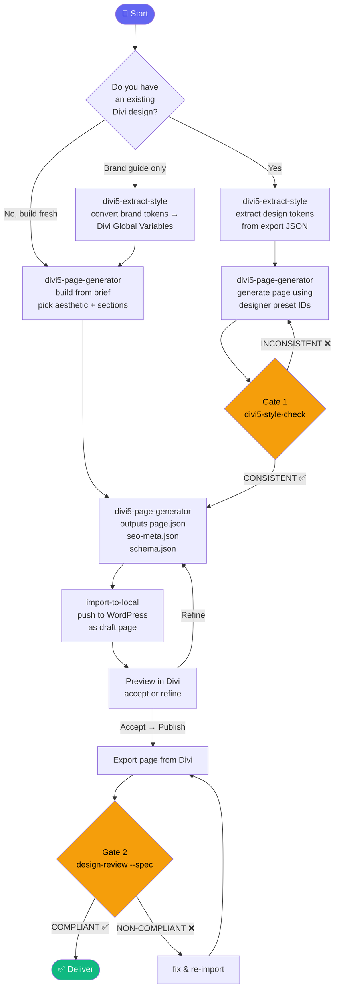
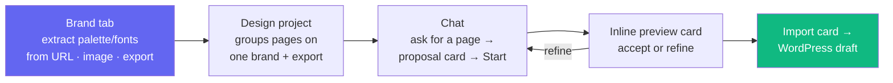

# Divi5Generate

Claude Code plugin for generating production-ready Divi 5 pages as importable JSON — SEO-optimised, preset-driven, validated before delivery. Includes a local browser app with Claude chat, one-click import to any WordPress site, and a full QA gate system.

## Install

**Step 1 — add the marketplace and install (run in your terminal):**

```bash
claude plugin marketplace add Kieransaunders/Divi5Generate
claude plugin install divi5generate@divi5generate
```

**Step 2 — open Claude Code Desktop.** It picks up the install automatically from `~/.claude`. Node.js must be on your PATH.

> **Tip:** After installing, run `/divi5generate:launch` to open the browser app, or say *"launch the generator"* and Claude will start it for you.

---

## How it works



---

## Skills

| Skill | What it does |
|-------|-------------|
| `divi5generate:divi5-page-generator` | Generate a complete Divi 5 page from a brief — full SEO, presets, HTML preview gate, validated JSON |
| `divi5generate:divi5-extract-style` | Extract the design system from an existing Divi export OR convert brand guidelines into Divi 5 Global Variables |
| `divi5generate:divi5-style-check` | QA gate — compare a generated page against the original designer export to verify preset, colour, and font inheritance |
| `divi5generate:design-review` | Audit any Divi 5 export: structure, SEO, design checklist. Also spec compliance mode: compare an imported page against the original brief |
| `divi5generate:import-to-local` | Import a generated page into any WordPress site — draft, preview, publish on accept |
| `divi5generate:divi5-plugin-dev` | Scaffold, build, and debug custom Divi 5 modules and plugins |
| `divi5generate:divitheatre-engine` | Theatre.js motion engine reference for DiviTheatre animation presets |

## Commands

| Command | What it does |
|---------|-------------|
| `/divi5generate:launch` | Start the local generator app and open it at http://localhost:3747 |
| `/divi5generate:help` | Setup guide — install the WordPress importer plugin and get your API key |

---

## Local App

The plugin ships a browser-based app that is **chat-primary** — you drive the
whole flow from a Claude conversation, with the structured form demoted to a
"Brief" drawer for when you want it.

```bash
/divi5generate:launch
```

Opens at **http://localhost:3747** with:
- **Chat tab** (default) — ask for a page in plain language. When Claude proposes a build it emits a proposal card with a **Start** button; generations stream inline, then surface a preview card and an import card.
- **Brand tab** — create/edit **Brand Profiles** (palette, fonts, voice). Seed one from a URL, a logo image (canvas colour extraction), or a Divi export.
- **Designs tab** — **Design Projects** group the pages built on one brand + export. The 2nd page on the same brand+export auto-promotes into a project.
- **Settings tab** — WordPress site URL + API key for one-click import.



---

## Full workflow with QA gates

```
divi5-extract-style  →  ClientBrand.tokens.js
         ↓
divi5-page-generator →  new-page.json
         ↓
divi5-style-check  original-export.json  new-page.json
         ↓  (must be CONSISTENT)
import-to-local    →  live WordPress draft
         ↓
Export from Divi  →  exported-page.json
         ↓
design-review  exported-page.json  --spec brief.md
         ↓  (must be COMPLIANT)
✓ Deliver
```

**Gate 1 — style-check** (pre-import): verifies the generated page reuses the designer's preset IDs, palette colours, and fonts.

**Gate 2 — design-review --spec** (post-import): verifies the live page delivers what the brief specified — sections, CTAs, copy, section order.

---

## Which workflow do I need?

### Existing Divi design → new pages in the same style

```
1. divi5-extract-style homepage-export.json
   → ClientBrand.tokens.js + ClientBrand.variables.json

2. divi5-page-generator "About Us page for [brand] — use ./ClientBrand.tokens.js"

3. divi5-style-check homepage-export.json about-us-page.json  (must be CONSISTENT)

4. import-to-local about-us-page.json → export → design-review --spec brief.md
```

### Brand guidelines → pages from scratch

```
1. divi5-extract-style "Primary #1A2744, Accent #F97316, heading Space Grotesk, body Inter"
   → Brand_Global-Variables.json

2. divi5-page-generator "Landing page for [brand], keyword [keyword]"

3. design-review --spec brief.md  (post-import)
```

### No existing design — just build it

```
divi5-page-generator "Landing page for Westcountry Pet Rescue,
  keyword 'adopt a rescue dog Devon', sections: Hero, Stats, How It Works, CTA"
```

---

## Output files

| File | Purpose |
|------|---------|
| `[brand]-page.json` | Import via Divi Library (tick "Import Presets") |
| `[brand]-seo-meta.json` | Title, meta description, slug — paste into Yoast / RankMath |
| `[brand]-schema.json` | JSON-LD — paste into Divi Theme Options → Integration → head |
| `[brand].tokens.js` | Token map for generating additional pages in the same style |
| `[brand].variables.json` | Importable Divi Global Variables for seeding a fresh site |

---

## WordPress Importer Plugin

`import-to-local` pushes pages into WordPress via the **Divi Tools Importer** plugin.

```
/divi5generate:help
```

Builds `divi-tools-importer.zip` → install via **WP Admin → Plugins → Add New → Upload Plugin → Activate** → copy your Site URL and API key from **Settings → Divi Tools Importer**.
