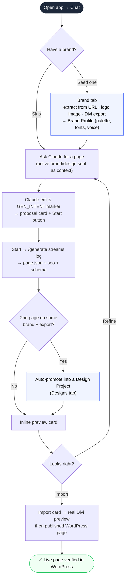

# Divi 5 Tools — User Flow

## Chat-primary app flow (local app, default)

The local app is chat-first: you describe the page, Claude proposes a build, you
hit **Start**, and the result streams back with preview + import cards. Brand
Profiles and Design Projects give the chat persistent context.

---

## Skill / CLI flow with QA gates

The underlying skills can also be driven directly from a Claude Code session.
The full gated workflow:

```mermaid
flowchart TD
    START([Start]) --> Q1{Do you have an\nexisting Divi site\nor export?}

    %% ── Branch A: existing design ──────────────────────────────────────────
    Q1 -->|Export file| A1["divi5-extract-style\nhomepage-export.json"]
    A1 --> A2["Outputs:\nClientBrand.tokens.js\nClientBrand.variables.json"]
    A2 --> Q2{Fresh site\nor existing?}
    Q2 -->|Fresh site| A3["Import ClientBrand.variables.json\nDivi Library → Import Global Variables\n\nImport original export\nwith 'Import Presets' checked"]
    Q2 -->|Existing site| A4["Presets already live —\nno import needed"]
    A3 --> GEN
    A4 --> GEN

    Q1 -->|Live WordPress site| A5["brand-extract\nsite URL + Divi Tools Connector API key\n→ saved Brand Profile"]
    A5 --> GEN

    %% ── Branch B: brand guide only ─────────────────────────────────────────
    Q1 -->|No — have brand guide| B1["divi5-extract-style\n'Primary #1A2744, Accent #F97316,\nfont Space Grotesk…'"]
    B1 --> B2["Outputs:\nBrand_Global-Variables.json"]
    B2 --> B3["Import via\nDivi Library → Import Global Variables"]
    B3 --> GEN

    %% ── Branch C: no design at all ─────────────────────────────────────────
    Q1 -->|No — start from scratch| GEN

    %% ── Generation ─────────────────────────────────────────────────────────
    GEN["divi5-page-generator\nbrand · keyword · sections · CTA"]
    GEN --> BRIEF["Stage 1 — Brief\nBrand + offer · keyword · aesthetic · sections · CTA\nState Design Read"]
    BRIEF --> SPEC["Stage 2 — page-spec.json\nAuthor the source spec\nRun validate-spec.js"]
    SPEC --> PREVIEW["HTML preview\nspec-to-html.js → preview-brand.html\nInteractive: user approves\nHeadless: self-approve"]
    PREVIEW --> APPROVED{Approved?}
    APPROVED -->|No — iterate| SPEC
    APPROVED -->|Yes| BUILD["Stage 3 — Compile + validate\nspec-to-divi.js → layout JSON + SEO + schema\nRun validate.js + taste-check.js\nFix all FAILs"]
    BUILD --> FIDELITY["Stage 3.5 — Fidelity gate\nfidelity-check.js against approved HTML\nBlocks delivery on FAIL"]

    %% ── Gate 1: style check ────────────────────────────────────────────────
    FIDELITY --> Q3{Designer export\npresent?}
    Q3 -->|Yes| STYLECHECK["divi5-style-check\noriginal-export.json  new-page.json"]
    STYLECHECK --> SC_RESULT{Result?}
    SC_RESULT -->|INCONSISTENT — FAILs| FIX1["Fix page-spec or generator inputs\nRegenerate"]
    FIX1 --> STYLECHECK
    SC_RESULT -->|CONSISTENT ✓\nor WARN-only| IMPORT
    Q3 -->|No| IMPORT

    %% ── Import ─────────────────────────────────────────────────────────────
    IMPORT["import-to-local\nbrand-page.json"]
    IMPORT --> REAL_PREVIEW["POST /preview\nReal Divi render before full import\nApprove or refine"]
    REAL_PREVIEW --> PREVIEW_OK{Preview approved?}
    PREVIEW_OK -->|No — refine| FIX2["Fix page-spec or generator inputs\nRegenerate + re-validate"]
    FIX2 --> BUILD
    PREVIEW_OK -->|Yes| PUBLISH["POST /import\nstatus: publish\nsame slug updates in place"]
    PUBLISH --> LIVE_PREVIEW["Playwright screenshot\nCompare live page vs HTML mockup\nRun visual diff where available"]
    LIVE_PREVIEW --> RENDER_OK{Render matches\nmockup?}
    RENDER_OK -->|No — render bug| FIX4["Fix preset CSS / button enable /\ncache / shortcode token\nRe-import"]
    FIX4 --> REAL_PREVIEW
    RENDER_OK -->|Yes| POSTCHECK

    %% ── Gate 2: spec compliance ────────────────────────────────────────────
    POSTCHECK["Optional post-import evidence"] --> EXPORT_PAGE["Export live page from Divi\nexported-page.json"]
    EXPORT_PAGE --> Q4{Brief or spec\ndocument exists?}
    Q4 -->|Yes| SPECCHECK["design-review\nexported-page.json --spec brief.md"]
    SPECCHECK --> SC2_RESULT{Result?}
    SC2_RESULT -->|NON-COMPLIANT — FAILs| FIX3["Fix missing sections / CTAs / copy\nin page-spec, regenerate + re-import"]
    FIX3 --> SPECCHECK
    SC2_RESULT -->|COMPLIANT ✓| DELIVER
    Q4 -->|No| DELIVER

    %% ── Deliver ────────────────────────────────────────────────────────────
    DELIVER(["✓ Deliver\nbrand-page.json\nbrand-seo-meta.json\nbrand-schema.json"])

    %% ── Styling ────────────────────────────────────────────────────────────
    style STYLECHECK fill:#f0f4ff,stroke:#4a6cf7,color:#000
    style SPECCHECK  fill:#f0f4ff,stroke:#4a6cf7,color:#000
    style SC_RESULT  fill:#fff8e1,stroke:#f59e0b,color:#000
    style SC2_RESULT fill:#fff8e1,stroke:#f59e0b,color:#000
    style FIX1       fill:#fff0f0,stroke:#ef4444,color:#000
    style FIX2       fill:#fff0f0,stroke:#ef4444,color:#000
    style FIX3       fill:#fff0f0,stroke:#ef4444,color:#000
    style FIX4       fill:#fff0f0,stroke:#ef4444,color:#000
    style DELIVER    fill:#f0fff4,stroke:#22c55e,color:#000
    style START      fill:#1e293b,stroke:#1e293b,color:#fff
```

## Reading the diagram

| Colour | Meaning |
|--------|---------|
| Blue border | QA gate skill — must pass before proceeding |
| Amber | Decision point with pass/fail outcome |
| Red | Fix loop — return to previous step |
| Green | Delivery — all gates passed |

## Gate summary

| Gate | Skill/script | When required | Blocks on |
|------|--------------|---------------|-----------|
| Spec compatibility | `validate-spec.js` | Every spec-first page build | Unknown or unsupported page-spec vocabulary |
| Structural + SEO validation | `validate.js` | Every page build | FAIL: invalid Divi JSON, missing SEO contract, broken structure |
| Taste check | `taste-check.js` | Every page build | FAIL: obvious design-quality issues |
| Fidelity check | `fidelity-check.js` | Every page build before import | FAIL: generated JSON does not match the approved HTML preview |
| Style consistency | `divi5-style-check` | Designer export present | FAIL: new preset IDs or off-palette colours |
| Real Divi preview | `import-to-local` `/preview` step | Before full WordPress import | User rejects preview or render is visibly broken |
| Live visual check | `import-to-local` screenshot / `visual-diff.js` | After import | Render drift above threshold or visible live-page defects |
| Spec compliance | `design-review --spec` | Brief/spec document exists | FAIL: missing sections, wrong CTAs, absent content |

The skills treat the generator, fidelity, and import preview gates as blocking. Style consistency and spec compliance are conditional on having the relevant source export or brief, but should not be skipped when those inputs exist.
